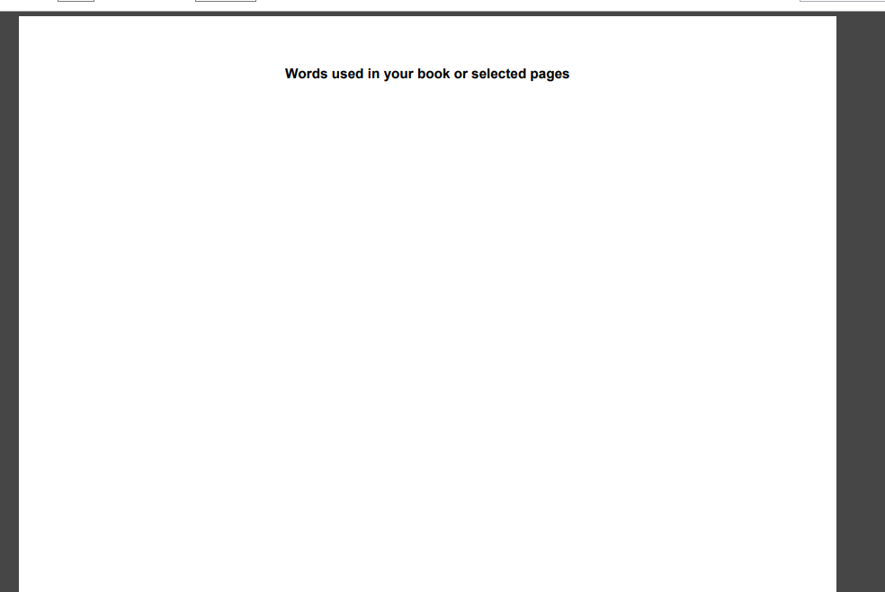
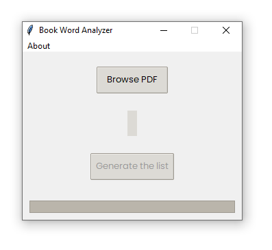
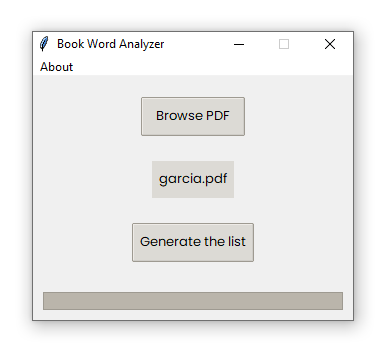
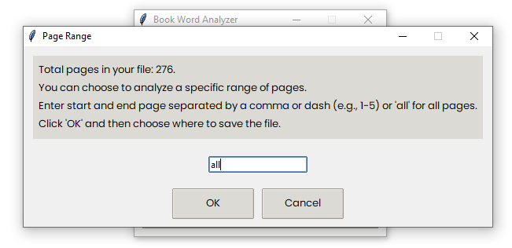
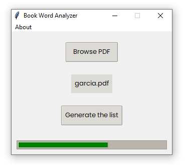
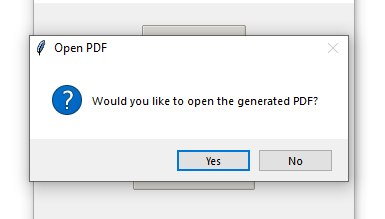
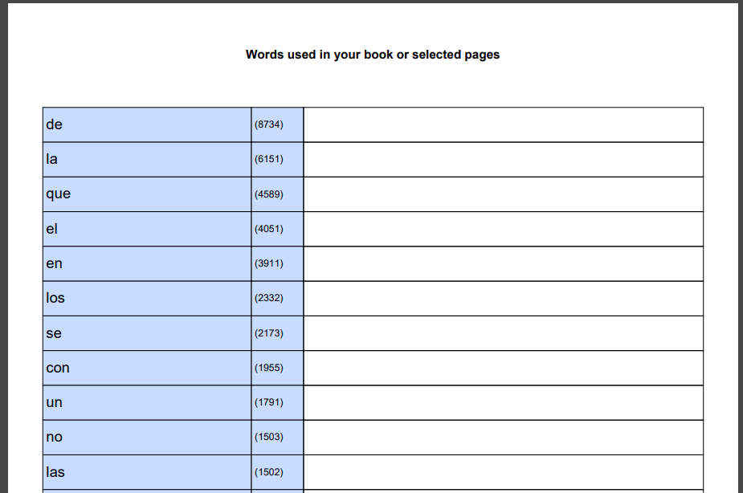

# Book Word Analyzer

This project I initiated out of personal interest.

While reading a book in a foreign language, and grappling with its meaning, I was struck by an idea.
Why not extract all the words and create a frequency list, along with a space for translations?
With this list in hand, I could then craft flashcards, prioritizing the most frequent words.

## Please note!

For now the program can only parse the text PDFs.
The version that can parse PDFs that have text in the images is still under development.
If while generating the list you get something like this:

...then this means that the PDF is scanned, and the text is in the images.

## Run the application

1. Clone the project and run it from your IDE
2. Download and run the .exe file in the **dist** folder

### 1. When you start the program

You will be greeted with the screen such as shown below.

### 2. Choose the file you want to parse by clicking on the **Browse PDF**

### 3. Once the file is chosen, its name will be displayed below the **Browse PDF** button.

### 4. Click on **Generate the list**

You will see the total amount of pages in the file.
You will as well be presented with a few options on how you want to parse the file.
I, for example, typed _all_

### 5. Click **OK** and choose where you want to save your file. After that wait for the program to scan and create the list for you.

### 6. A window will then inform you that the "PDF generated and saved to ... YOUR LOCATION HERE". Click **OK**

### 7. At last another message will ask you if you want to open the newly generated PDF.

### 8. As a result you should get something like the following, where:

- Left column is the word
- Middle column represents the frequency of that word in the book, or a file.
- The right column is for you to write the translation/synonyms/comments/etc., if such need arises.

### 9. The words are sorted in descending order.

- From most used >>> to least used
- This way you can focus on learning the most frequent words first.
